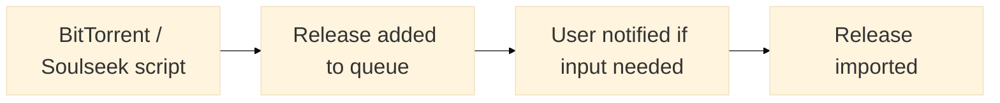

_Fast automated music tagging and organisation based on MusicBrainz_

---

**wrtag** is similar to music tagging and organisation tools such as [Beets](https://beets.io/) and [MusicBrainz Picard](https://picard.musicbrainz.org/) but aims to be simpler, more composable, and faster.

To describe the general workflow:

1. Input files are given (existing or new)
2. They are matched with releases in the [MusicBrainz database](https://musicbrainz.org/). This may be done using existing tags or filenames
3. The files are moved or copied to a user-defined filesystem layout. For example `My music/Artist name/(Release year) Release name/1. Track title.ext`
4. The file's tags are updated to match the tags in the MusicBrainz database
5. Enjoy a clean, consistent, and accurate browsing experience in your music player/server of choice

# Table of Contents

1. [Features](#features)
2. [Included tools](#included-tools)
   - [Tool `wrtag`](#tool-wrtag)
     - [Importing new music](#importing-new-music)
     - [Re-tagging already imported music](#re-tagging-already-imported-music)
     - [Re-tagging in bulk](#re-tagging-in-bulk)
   - [Tool `wrtagweb`](#tool-wrtagweb)
     - [API](#api)
     - [Configuration](#configuration)
     - [Options](#options)
3. [Global configuration](#global-configuration)
   - [Options](#options-1)
   - [Format](#format)
     - [CLI arguments](#cli-arguments)
     - [Environment variables](#environment-variables)
     - [Config file](#config-file)
4. [Installation](#installation)
5. [Addons](#addons)
6. [Notifications](#notifications)
7. [Path format](#path-format)
8. [Goals and non-goals](#goals-and-non-goals)

# Features

- Unix-style suite of tools for different use cases, using the same core **wrtag** functionality
- **Fast** tagging thanks to [Go](https://go.dev/)
- Filesystem organization of music files, covers, and configurable extra files
- **Cover fetching** or upgrades from the [Cover Art Archive](https://coverartarchive.org/)
- Care taken to ensure **no orphan** folders are left in the library when moves or copies happen
- Validation to ensure your library is **always consistent** with no duplicates or unrecognized paths
- Safe **concurrent** processing with tree-style filesystem locking
- Addons for fetching lyrics, calculating [ReplayGain](https://wiki.hydrogenaud.io/index.php?title=ReplayGain_2.0_specification), or any user-defined subprocess
- Rescanning library and processing it for new changes in MusicBrainz (`wrtag sync`)
- An optional **web interface** for importing new releases over the network. Allows the user to be notified and confirm details if there is no 100% match found
- Support for [gazelle-origin](https://github.com/x1ppy/gazelle-origin) files to improve matching from certain sources
- Support for **Linux**, **macOS**, and **Windows** with static/portable [binaries available](https://github.com/sentriz/wrtag/releases) for each

# Included tools

## Tool `wrtag`


The `wrtag` tool is the main command line tool for music organization. It has two subcommands for working on individual folders (`copy`, `move`), and one for bulk processing (`sync`).

### Importing new music

#### Moving from source

`wrtag` is the main command line tool that works on a single folder and requires an operation such as `move` or `copy`.

For example:

```console
$ wrtag move "Example"                 # tags and moves `Example` into library defined by the path-format config option
$ wrtag move -dry-run "Example"        # shows move and tag operations without applying them
$ wrtag move -yes "Example"            # use anyway even if low match
$ wrtag move -mbid "abc" -yes "Example" # overwrite matched MusicBrainz release UUID
```

#### Copying from source

If the source files should be left alone, wrtag also provides a `copy` operation:

```console
$ wrtag copy -yes "Example"      # copies and tags `Example` into library, use anyway even if low match
$ wrtag copy -mbid "abc" -yes    # overwrite matched MusicBrainz release UUID even if low match
```

### Re-tagging already imported music

Re-tagging your music can be useful for a few reasons. For example, if your path-format configuration has changed, or the metadata in the MusicBrainz database has changed.

Since a `move` operation always cleans up the source directory - and is smart about the music already being in place - a re-tag is just a move pointed at some music which is already in-place:

```console
# path-format is /my/music/XXX
$ wrtag move "/my/music/Tame Impala/(2010) Innerspeaker"
# now has updated tags, and moved again if needed
```

### Re-tagging in bulk

Bulk operations are done with the `sync` subcommand. Unlike the `copy` and `move` commands which operate on single releases, the `sync` command works on your already imported and tagged library.

> [!WARNING]
> As the `sync` command is non-interactive, when used incorrectly it can be destructive. Only use `sync` on a library whose contents have been populated by `copy` or `move`.

By default, `sync` recurses through all directories rooted in `path-format` and finds leaf directories. A leaf directory is one which has no sub-folders, and therefore looks like a release. The tracks are read, and if they have a `MUSICBRAINZ_ALBUMID` (e.g., from `copy` or `move`), the release info is fetched from MusicBrainz and the release is re-tagged.

If no `MUSICBRAINZ_ALBUMID` is present, the release is matched as it usually would, and only re-tagged if a high match score is calculated.

```console
$ wrtag sync                          # recurse all releases and re-tag
$ wrtag sync -dry-run                 # show what above would do
$ wrtag sync "/my/music/Tame Impala"  # find all releases in "Tame Impala/" and re-tag those
$ wrtag sync -age-older 24h           # find all releases older than 1 day and re-tag
$ wrtag sync -num-workers 16          # process max of 16 releases at a time
```

## Tool `wrtagweb`


`wrtagweb` is based on the same core functionality as `wrtag` core, except it's web-based instead of command line. Instead of importing releases from the command line arguments, new releases are imported over HTTP.

For example, a HTTP client (a custom script, a BitTorrent client "on complete" script, or Soulseek) sends a HTTP request to `wrtagweb`, giving it a new path to import. `wrtagweb` imports it. If there isn't a 100% match, the user is notified. Then, the user can correct the match, reject, or accept anyway.



### API

Jobs are added to the queue with a HTTP request like `POST <wrtag.host>/op/<copy|move>` with form value `path=<absolute path to directory>`. The form value can be an `application/x-www-form-urlencoded` form body, or URL query parameter.

Authentication is via HTTP basic auth password, configured by `web-api-key`.

<details>
<summary><b>Example with <i>cURL</i></b></summary>

```console
curl \
    --request POST \
    --data-urlencode "path=/path/to/the/release" \
    "https://:my-api-key@wrtag.hostname/op/copy"
```

</details>

<details>
<summary><b>Example with <i>Transmission</i></b></summary>

Create a script named `done.sh` or anything you like, and make it executable:
`chmod +x done.sh`

Update your transmission `settings.json` to reference the new script:

```json
...
"script-torrent-done-enabled": true,
"script-torrent-done-filename": "/scripts/done.sh",
...
```

Edit the script to send a `copy` job with the newly finished torrent. Transmission will set TR_TORRENT_NAME to the name/path of the torrent. [See all variables](https://github.com/transmission/transmission/blob/main/docs/Scripts.md#on-torrent-completion)

```bash
#!/bin/sh

curl \
    --request POST \
    --data-urlencode "path=<path to downloads>/$TR_TORRENT_NAME" \
    "http://:<wrtag api key>@<wrtag host>/op/copy"
```

</details>

<details>
<summary><b>Example with <i>qBittorrent</i></b></summary>

> TODO

</details>

<details>
<summary><b>Example with <i>Deluge</i></b></summary>

> TODO

</details>

<details>
<summary><b>Example with <i>sldkd</i></b></summary>

> TODO

</details>

### Configuration

Configuration for wrtagweb works the same as [Global configuration](#global-configuration). For example `wrtagweb -web-arg`, `WRTAG_WEB_ARG`, and the global config file is also read.

### Options

<!-- gen with `wrtagweb -h 2>&1 | ./gen-docs | wl-copy` -->

| CLI argument     | Environment variable  | Config file key | Description                                    |
| ---------------- | --------------------- | --------------- | ---------------------------------------------- |
| -web-api-key     | WRTAG_WEB_API_KEY     | web-api-key     | api key for web interface                      |
| -web-db-path     | WRTAG_WEB_DB_PATH     | web-db-path     | db path for web interface (default "wrtag.db") |
| -web-listen-addr | WRTAG_WEB_LISTEN_ADDR | web-listen-addr | listen addr for web interface                  |
| -web-public-url  | WRTAG_WEB_PUBLIC_URL  | web-public-url  | public url for web interface (optional)        |

# Global configuration

Global configuration is used by all tools. Any option can be provided with a CLI argument, environment variable, or config file key. See [Format](#format) for more technical details.

### Options

<!-- gen with `wrtag -h 2>&1 | ./gen-docs | wl-copy` -->

| CLI argument      | Environment variable   | Config file key  | Description                                                                                    |
| ----------------- | ---------------------- | ---------------- | ---------------------------------------------------------------------------------------------- |
| -addon            | WRTAG_ADDON            | addon            | define an addon for extra metadata writing (see [Addons](#addons)) (stackable)                 |
| -caa-base-url     | WRTAG_CAA_BASE_URL     | caa-base-url     | CoverArtArchive base URL (default "<https://coverartarchive.org/>")                            |
| -caa-rate-limit   | WRTAG_CAA_RATE_LIMIT   | caa-rate-limit   | CoverArtArchive rate limit duration                                                            |
| -config           | WRTAG_CONFIG           | config           | print the parsed config                                                                        |
| -config-path      | WRTAG_CONFIG_PATH      | config-path      | path config file (default "$XDG_CONFIG_HOME/wrtag/config")                                     |
| -cover-upgrade    | WRTAG_COVER_UPGRADE    | cover-upgrade    | fetch new cover art even if it exists locally                                                  |
| -keep-file        | WRTAG_KEEP_FILE        | keep-file        | define an extra file path to kept when moving/copying to root dir (stackable)                  |
| -log-level        | WRTAG_LOG_LEVEL        | log-level        | set the logging level (default INFO)                                                           |
| -mb-base-url      | WRTAG_MB_BASE_URL      | mb-base-url      | MusicBrainz base URL (default "<https://musicbrainz.org/ws/2/>")                               |
| -mb-rate-limit    | WRTAG_MB_RATE_LIMIT    | mb-rate-limit    | MusicBrainz rate limit duration (default 1s)                                                   |
| -notification-uri | WRTAG_NOTIFICATION_URI | notification-uri | add a shoutrrr notification uri for an event (see [Notifications](#notifications)) (stackable) |
| -path-format      | WRTAG_PATH_FORMAT      | path-format      | path to root music directory including path format rules (see [Path format](#path-format))     |
| -research-link    | WRTAG_RESEARCH_LINK    | research-link    | define a helper url to help find information about an unmatched release (stackable)            |
| -tag-weight       | WRTAG_TAG_WEIGHT       | tag-weight       | adjust distance weighting for a tag (0 to ignore) (stackable)                                  |
| -version          | WRTAG_VERSION          | version          | print the version                                                                              |

### Format

### CLI arguments

Just call the command with the CLI argument. For example `wrtag -some-key "some value"`. For stackable (repeatable) arguments, pass them multiple times. For example `wrtag -some-key "value 1" -some-key "value 2"`.

> [!NOTE]
> Be aware of the position of global vs command arguments. For example `wrtag <global options> cmd <cmd options>`. Check `-h` when in doubt.

### Environment variables

Environment variables are prefixed with `WRTAG_` usually. For example `WRTAG_LOG_LEVEL=info wrtag`. For stackable (repeatable) arguments, join them with a comma (`,`). For example `WRTAG_ADDON="replaygain,lyrics genius musixmatch"`. If the value of the variable should have a comma, it can be escaped with a backslash. For example `\,`.

### Config file

The config file can be used instead of CLI arguments or environment variables. The format follows ([flagconf](https://pkg.go.dev/go.senan.xyz/flagconf?utm_source=godoc#hdr-usage)), which works like:

```
some-key argument
other-key argument
```

For stackable (repeatable) arguments, provide the same key multiple times. For example:

```
addon replaygain
addon lyrics genius musicbrainz
```

See the [example config](./config.example) for more.

# Installation

- You can find static/portable binaries (wrtag, wrtagweb, metadata) on the [releases page](https://github.com/sentriz/wrtag/releases) for Windows, macOS, and Linux
- Docker images for many architectures are available on [Docker Hub](https://hub.docker.com/r/sentriz/wrtag). The Docker image by default starts `wrtagweb`, but has the `wrtag` tools included too
- To install from source, install a recent [Go](https://go.dev/) toolchain, clone the repo, and run `go install ./cmd/...` from inside

# Addons

> TODO

# Notifications

> TODO

# Path format

> TODO

# Goals and non-goals

> TODO
