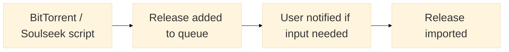

_Fast automated music tagging and organisation based on MusicBrainz_

---

**wrtag** is similar to music tagging and organisation tools such as [Beets](https://beets.io/) and [MusicBrainz Picard](https://picard.musicbrainz.org/) but aims to be more simple, composable, and faster.

To describe the general workflow:

1. Input files are given (existing or new)
2. They are matched with releases in the [MusicBrainz database](https://musicbrainz.org/). This may be with existing tags or filenames
3. The files are moved or copied to a user defined filesystem layout. For example `My music/Artist name/(Release year) Relase name/1. Track title.ext`
4. The file's tags are updated to match the tags in the MusicBrainz database
5. Enjoy a clean, consistent, and accurate browsing experience in your music player/server of choice

# Features

- Unix style suite of tools for different usecases, using the same core **wrtag** functionality
- **Fast** tagging thanks to [Go](https://go.dev/)
- Filesystem organization of music files, covers, configurable extra files
- **Cover fetching** or upgrades from the [Cover Art Archive](https://coverartarchive.org/)
- Care taken to make sure **no orphan** folders are left in library when moves or copies happen
- Validation to make sure library is **always consistent** with no duplicates or unrecognised paths
- Safe **concurrent** processing with tree-style filesystem locking
- Addons such for fetching lyrics, calculating [ReplayGain](https://wiki.hydrogenaud.io/index.php?title=ReplayGain_2.0_specification), or any user defined subprocess
- Rescanning library and processing library for new changes in the MusicBrainz (`wrtag sync`)
- A optional **web interface** for importing new releases over the network. Allows the user to be notified and confirm details if there is no 100% match found
- Support for [gazelle-origin](https://github.com/x1ppy/gazelle-origin) files to improve matching from certain sources
- Support for **Linux**, **macOS**, **Windows** with static/portable [binaries available](https://github.com/sentriz/wrtag/releases) for each

# Included tools

## Tool `wrtag`


The `wrtag` tool is main the command line tool for organisation of music. It has two subcommands for working on individual folders (`copy`, `move`), and one for bulk processing (`sync`)

### Importing new music

#### Moving from source

`wrtag` is the main command line tool it works on a single folder and needs an operation such as `move` or `copy`

For example

```console
$ wrtag move "Example"`                 # tags and moves `Example` into library defined by the path-format config option
$ wrtag move -dry-run "Example"         # shows move and tag operations without applying them
$ wrtag move -yes "Example"             # use anyway even if low match
$ wrtag move -mbid "abc" -yes "Example" # overwrite matched MusicBrainz release UUID
```

#### Copying from source

If the source files should be left alone, wrtag also proves a `copy` operation

```console
$ wrtag copy -yes "Example"`      # copies and tags `Example` into library, use anyway even if low match
$ wrtag copy -mbid "abc" -yes`    # overwrite matched MusicBrainz release UUID even if low match

```

### Re-tagging already imported music

Re-tagging your music can be useful for a few reasons. For example if your path-format configuration has changed, or the metadata in the MusicBrainz database has changed.

Since a `move` operation always cleans up the source directory - and is smart about the music already being in place - a re-tag is just a move pointed at some music which is already in-place

```console
# path-format is /my/music/XXX
$ wrtag move "/my/music/Tame Impala/(2010) Innerspeaker"
# now has updated tags, and moved again if needs be
```

### Re-tagging in bulk

Bulk operations are done with the `sync` subcommand. Unlike the `copy` and `move` command which operate on single releases, the `sync` command works on your already imported and tagged library

> [!WARNING]
> As the `sync` command is non-interactive, when used incorrectly it can be destructive. Only use `sync` on a library whose contents have been populated by `copy` or `move`

By default, `sync` recurses all directories rooted in `path-format` and finds leaf directories. A leaf directory is one which has no sub-folders, and therefore looks like a release. The tracks are read, if they have a `MUSICBRAINZ_ALBUMID` (eg. from `copy` or `move`), the release info is fetched from MusicBrainz and the release is re-tagged

If no `MUSICBRAINZ_ALBUMID` is present, the release is matched as it usually would, and only re-tagged if a high match score is calculated

```console
$ wrtag sync                          # recurse all releases and re-tag
$ wrtag sync -dry-run                 # show what above would do
$ wrtag sync "/my/music/Tame Impala"  # find all releases in "Tame Impala/" and re-tag those
$ wrtag sync -age-older 24h           # find all releases older than 1 day and re-tag
$ wrtag sync -num-workers 16          # process max of 16 releases at a time
```

## Tool `wrtagweb`


`wrtagweb` is based on the same core functionality as `wrtag` core, except it's web based instead of command line. Instead of importing releases from the command line arguments, new releases are imported over HTTP

For example a HTTP client (a custom script, a BitTorrent client "on complete" script or Soulseek) sends a HTTP request to `wrtagweb`, giving it a new path to import. `wrtagweb` imports. If there isn't a 100% match, the user is notified. Then, the user can correct the match, reject, or accept anyway



### API

Jobs are added to the queue with a HTTP request like `POST <wrtag.host>/op/<copy|move>` with form value `path=<absolute path to directory>`. The form value can be an `application/x-www-form-urlencoded` form body, or URL query parameter

Authentication is a HTTP basic auth password, configured by `web-api-key`

<details>
<summary><b>Example with <i>cURL</i></b></summary>

```console
curl \
    --request POST \
    --data-urlencode "path=/path/to/the/release" \
    "https://:my-api-key@wrtag.hostname/op/copy"
```

</details>

<details>
<summary><b>Example with <i>Transmission</i></b></summary>

create a script named `done.sh` or anything you like, and make it executable:
`chmod +x done.sh`

update your transmission `settings.json` to reference the new script

```json
...
"script-torrent-done-enabled": true,
"script-torrent-done-filename": "/scripts/done.sh",
...
```

edit the script to send a `copy` job with the newly finished torrent. Transmission will set TR_TORRENT_NAME to the name/path of the torrent. [See all variables](https://github.com/transmission/transmission/blob/main/docs/Scripts.md#on-torrent-completion)

```bash
#!/bin/sh

curl \
    --request POST \
    --data-urlencode "path=<path to downloads>/$TR_TORRENT_NAME" \
    "http://:<wrtag api key>@<wrtag host>/op/copy"
```

</details>

<details>
<summary><b>Example with <i>qBittorrent</i></b></summary>

> TODO

</details>

<details>
<summary><b>Example with <i>Deluge</i></b></summary>

> TODO

</details>

<details>
<summary><b>Example with <i>sldkd</i></b></summary>

> TODO

</details>

### Configuration

> TODO

# Global configuration

> TODO

# Installation

- You can find static/portable binaries (wrtag, wrtagweb, metadata) on the [releases page](https://github.com/sentriz/wrtag/releases) for Windows, macOS, and Linux
- Docker images for many architectures are available on [Docker Hub](https://hub.docker.com/r/sentriz/wrtag). The Docker image by default starts `wrtagweb`, but has the `wrtag` tools included too
- To install from source, install a recent [Go](https://go.dev/) toolchain, clone the repo, and `go install ./cmd/...` from inside

# Goals and non-goals

> TODO
